# This is the README file for the android application

## We will demonstrate how to sign in and register via the android app:

### Sign in:

#### In order to sign in you will need to reach the login page.

#### To do so you can go to the profile page (in order to enter your profile page you will need to press on the face icon in the navigation bar) and press on the "login" button (there are other ways, like swipe right or press on the navigation button in the home page - the compass icon)

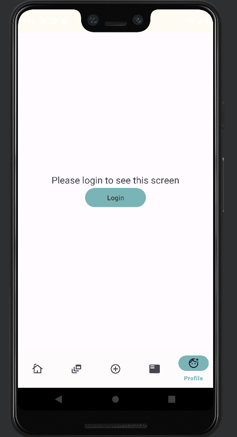

#### Enter your details and login

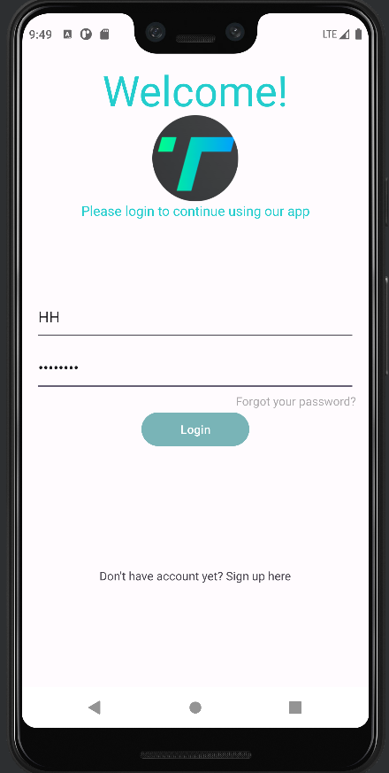

### Register:

#### In order to sign in you will need to reach the login page (like written in the "Sign in" instructions) and then press on the text beneeth the "login" button

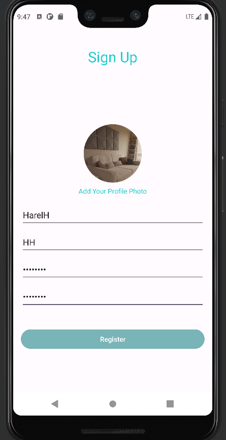

## Now we demonstrate how to delete/add/edit a video via the android app:

### Deleting a video:

#### In order to delete one of your videos you will need to enter the video that you want to delete ,you can search it or go to your profile page and play it from there (in order to enter your profile page you will need to press on the face icon in the navigation bar)

#### Then you should click on the bin icon

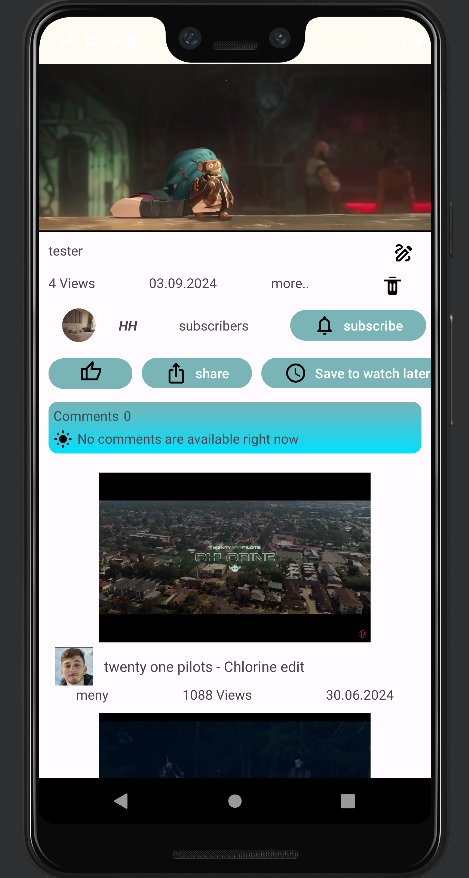

#### Now you need to confirm the deletion (this is a different video because I forgot to screenshot the dialog)

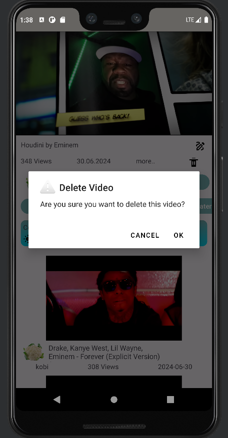

#### And there you have it! (this is from your profile page in order to get there you will need to press on the face icon in the navigation bar)

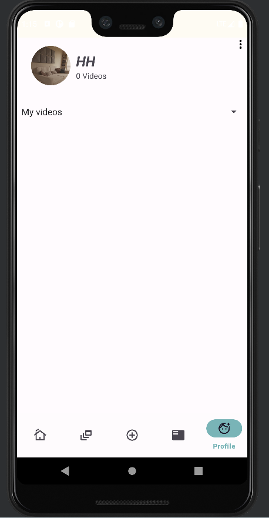

### Adding new video:

#### In order to add new video you will need to press on the + icon in the navigation bar

#### Now you should select video to upload

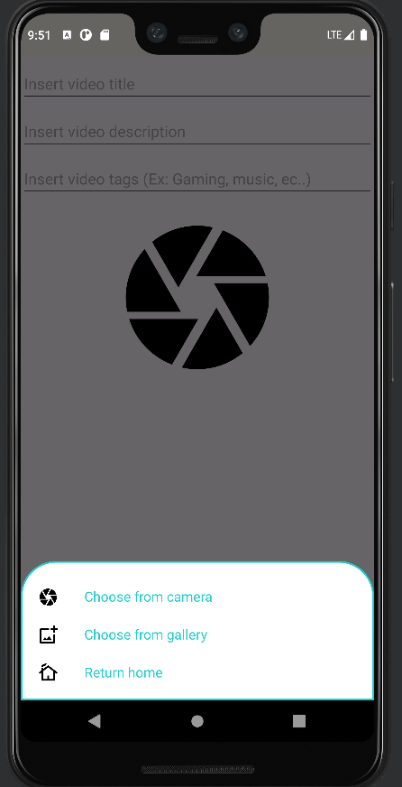

#### Then you will need to fill al the fields

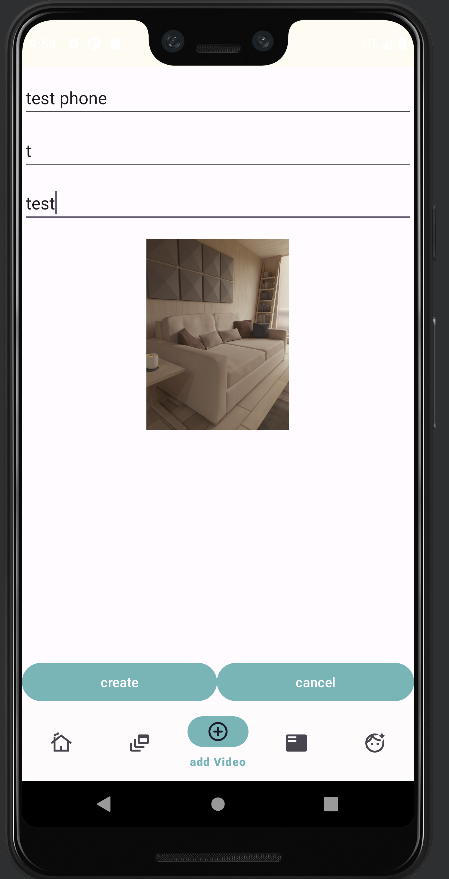

#### And there you have it! (this is from your profile page in order to get there you will need to press on the face icon in the navigation bar, the video maybe not apper right away because the upload is happening in the background)

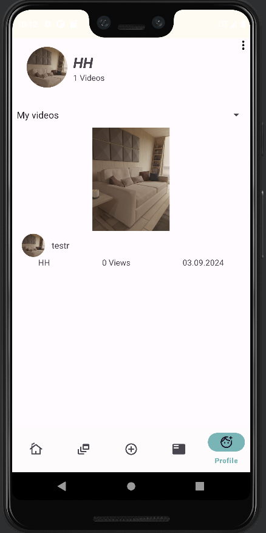

### Editing a video:

#### In order to edit one of your videos you will need to enter the video that you want to edit ,you can search it or go to your profile page and play it from there (in order to enter your profile page you will need to press on the face icon in the navigation bar)

#### Then you should click on the drawing icon

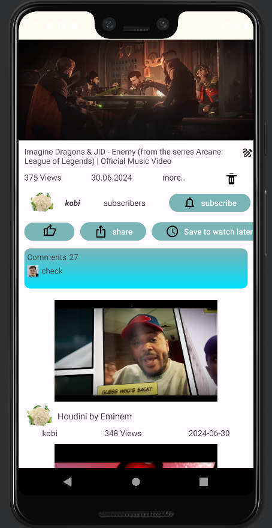

#### Change the title as you like and press on the save icon (you also can edit the description, you need to press on "more" and a drawing icon will appear there)

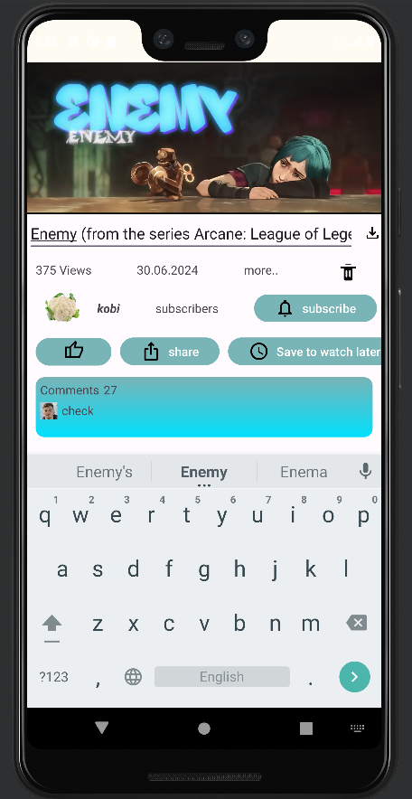

#### There you have it!

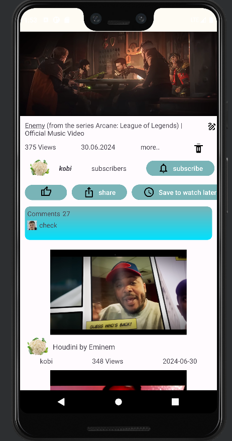
