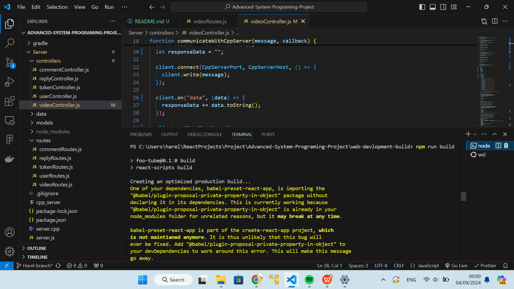
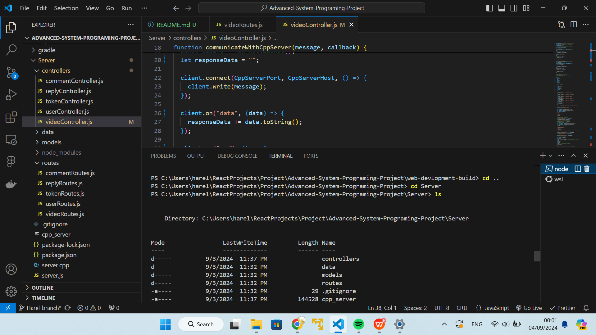
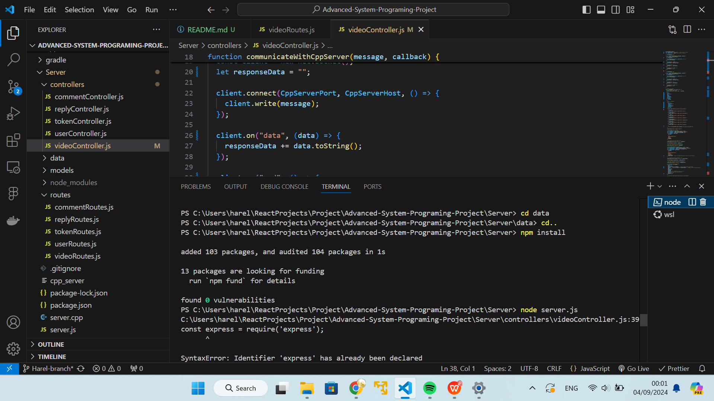
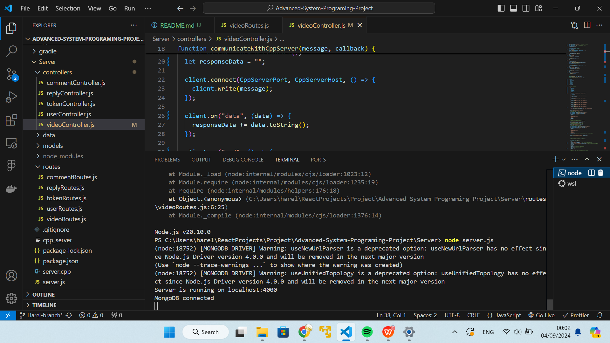
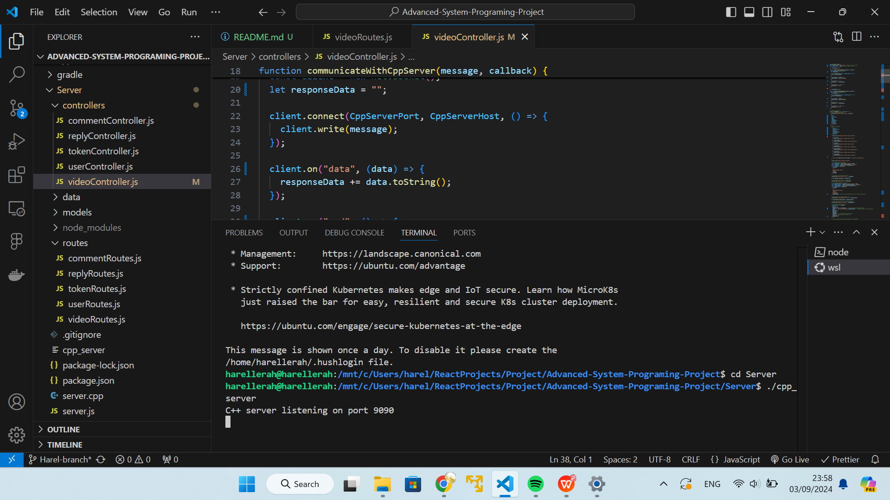

# Wiki

## First we demonstrate how to setup the enviroment:

(All the steps are in the README file at the beaggining of the repository)

### Preperations of the web app and server:

### Set up the TCP server:

There are 2 README files for the different platforms each one of them includes an example of sign in and registering to the app, also they includes examples of adding/editing/deleting videos
