# This is the README file for the web application

## We will demonstrate how to sign in and register via the web app:

### Sign in:

#### In order to sign in you will need to press on the "Sign in" button in the top right corner

#### (Before)

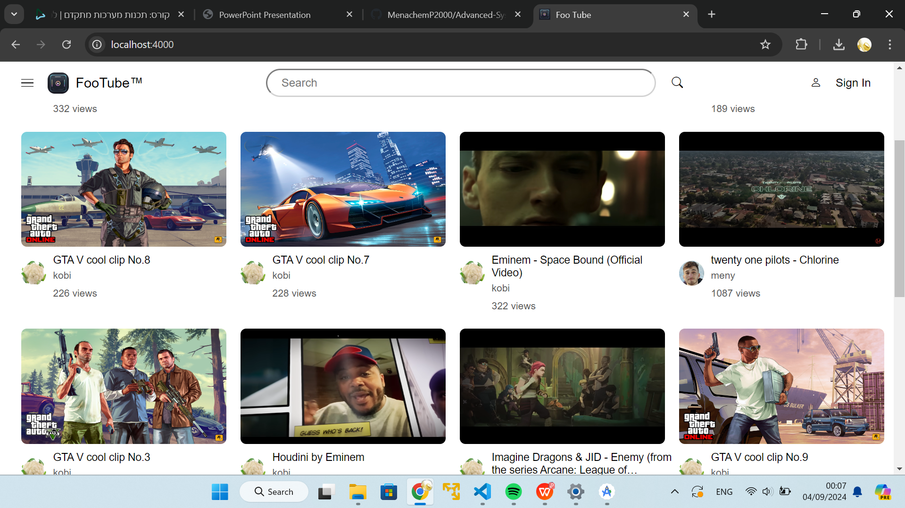
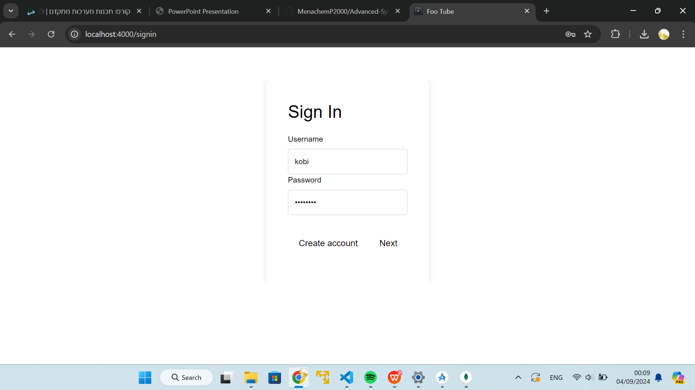

#### Now you need to click on "Next" and you're in!

#### (After)

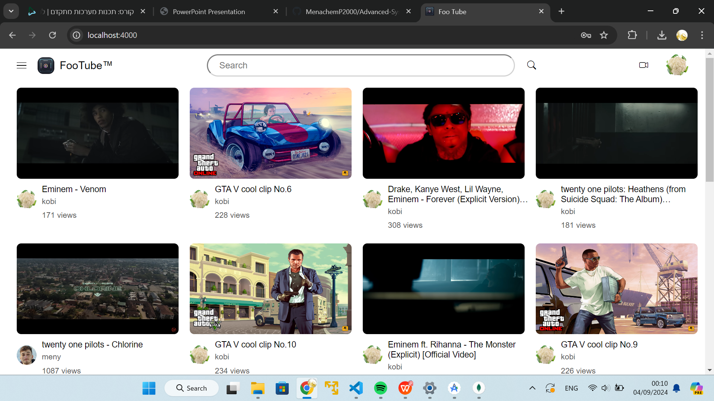

#### Now you can see that instead of the "Sign in" button your profile pic displays

### Register:

#### In order to sign in you will need to press on the "Sign in" button in the top right corner and click on "Create Account"

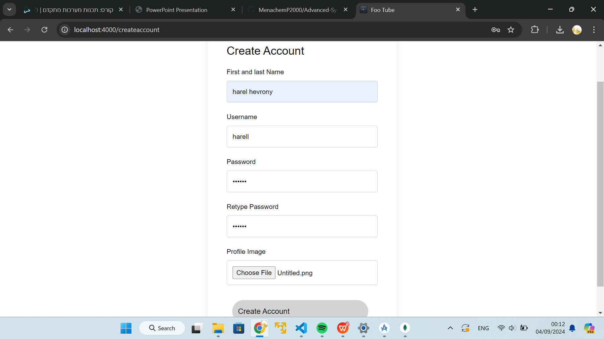
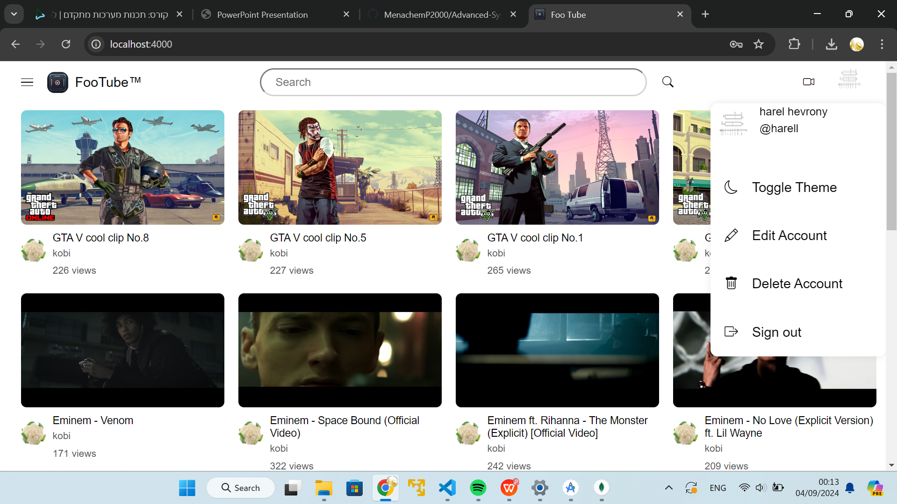

## Now we demonstrate how to delete/add/edit a video via the web app:

### Deleting a video:

#### In order to delete one of your videos you will need to enter the video that you want to delete ,you can search it or go to your profile page and play it from there (in order to enter your profile page you will need to press on your profile pic and in the menu that pops up you need to click on your name)

#### Then just press on delete an the video will be deleted

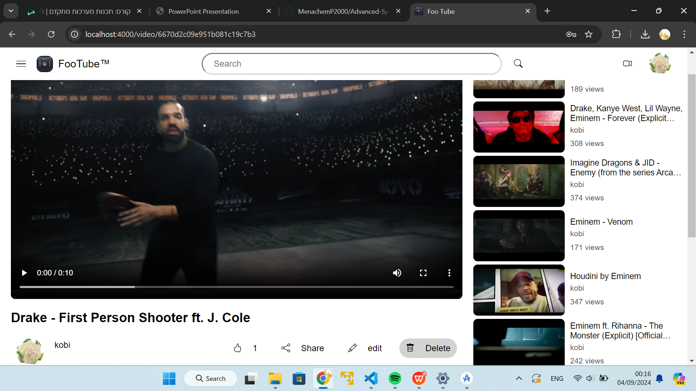

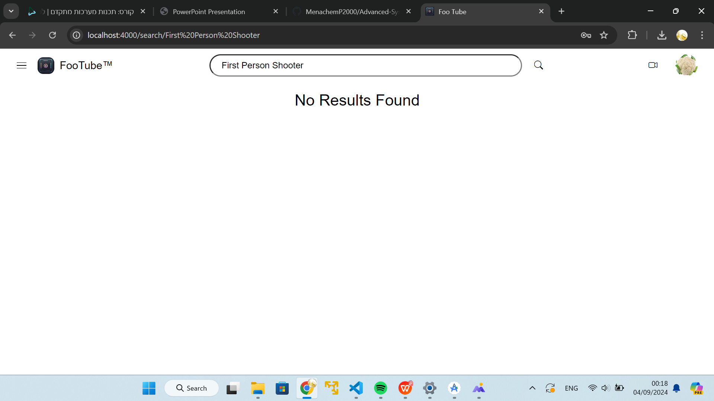

#### (Two clients simultenesly)

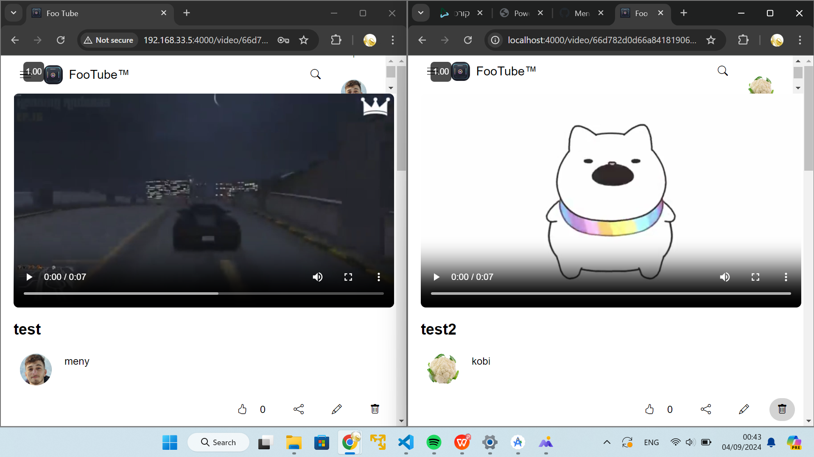
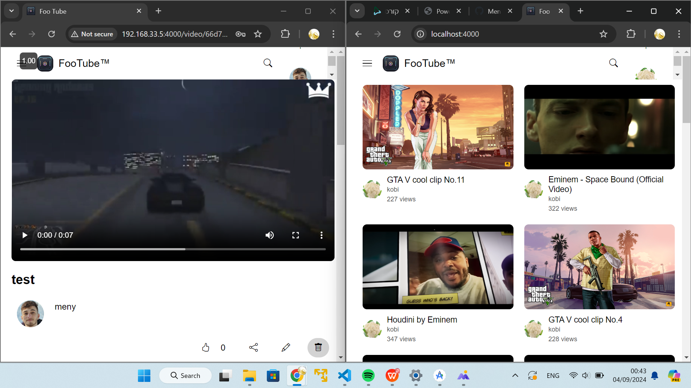
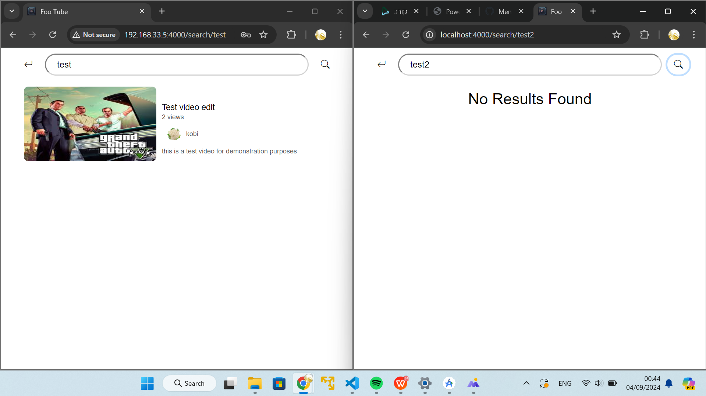

### Adding new video:

#### In order to add a new video you will need to press on the camera icon near your profile picture

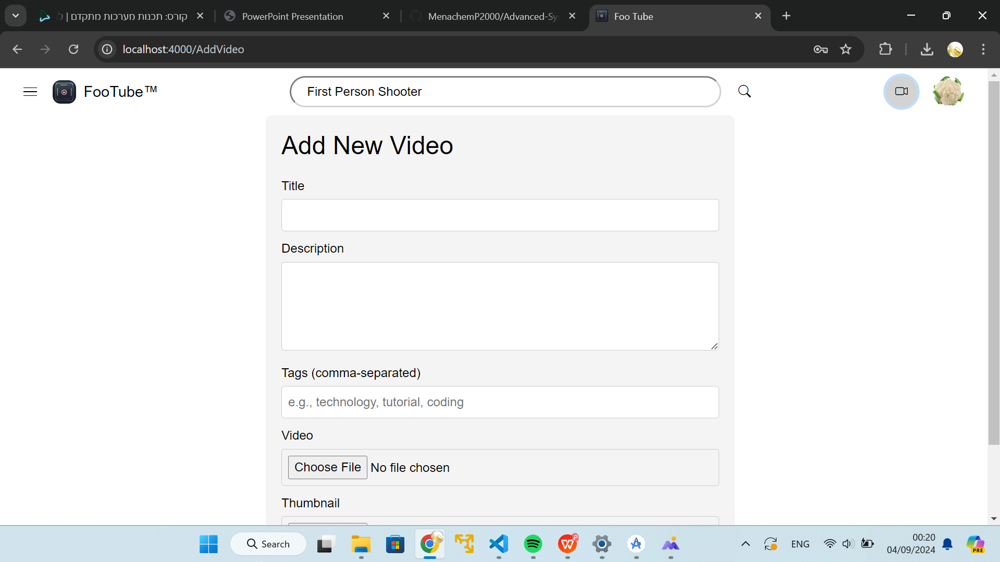

#### Then fill out all the fields

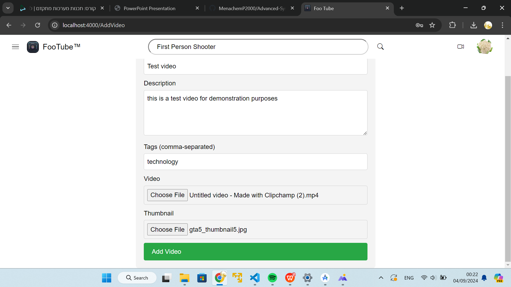

#### And there you have it!

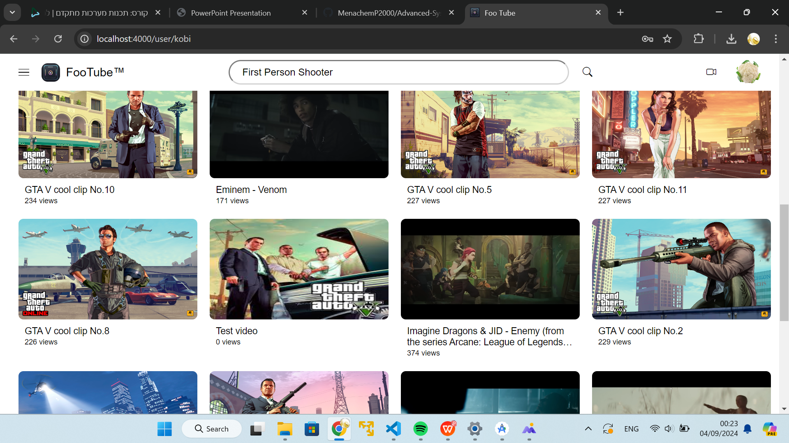

#### (Two clients simultenesly)

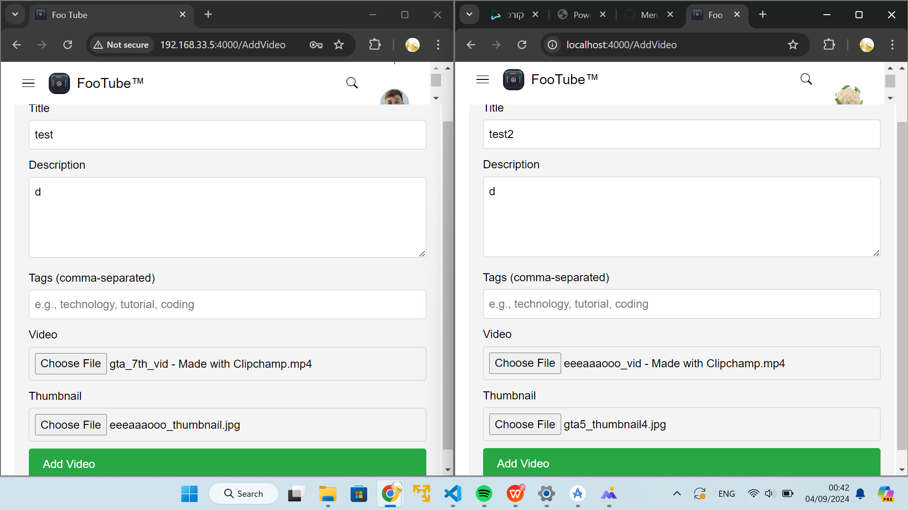
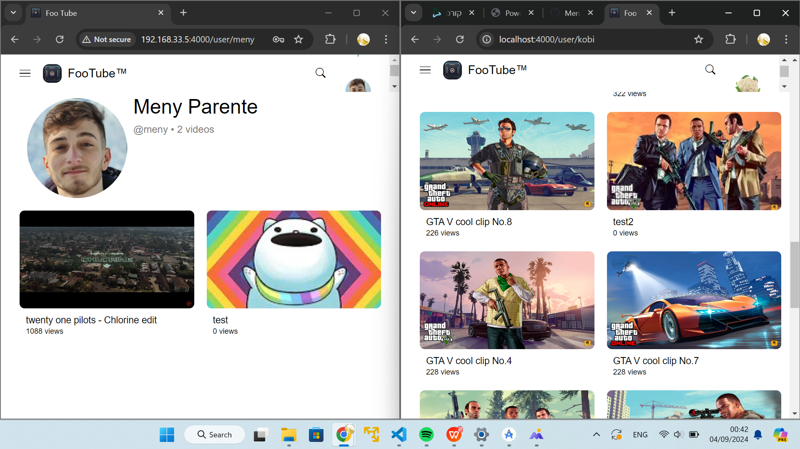

### Editing a video:

#### In order to edit one of your videos you will need to enter the video that you want to edit ,you can search it or go to your profile page and play it from there (in order to enter your profile page you will need to press on your profile pic and in the menu that pops up you need to click on your name)

#### Then press on edit and edit your title (you also can edit the description, there is a button for that under the description box)

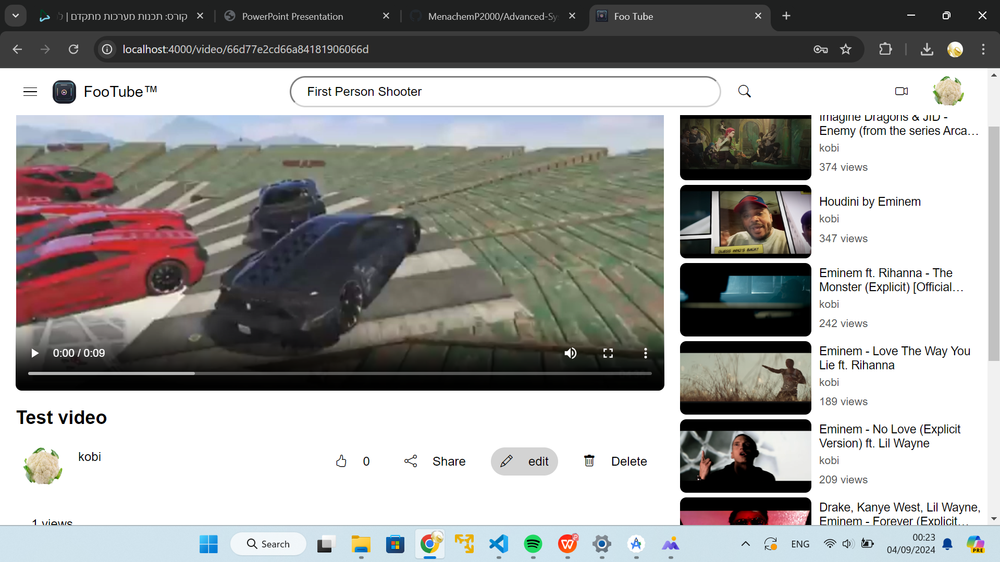

#### Now hit save and you have it!

#### (Two clients simultenesly)

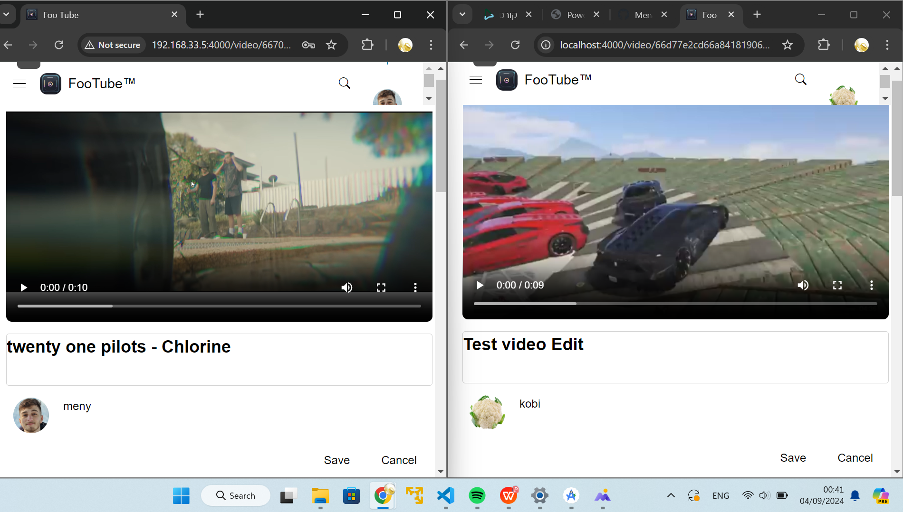
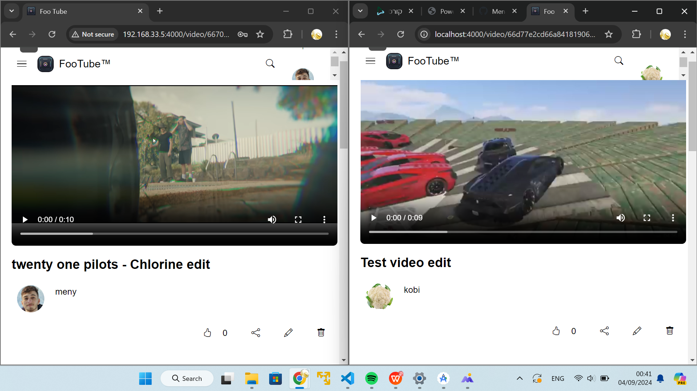
